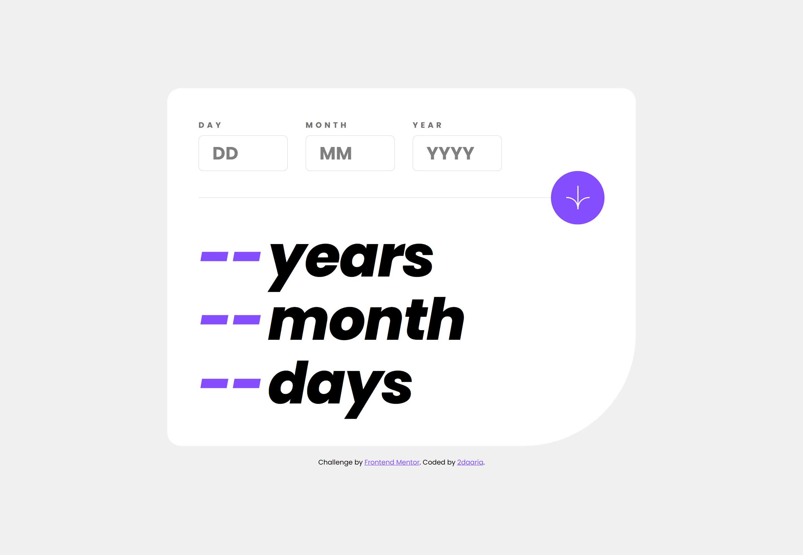

This is a solution to the [Age calculator app challenge on Frontend Mentor](https://www.frontendmentor.io/challenges/age-calculator-app-dF9DFFpj-Q).

### Author
Frontend Mentor - [@2daaria](https://www.frontendmentor.io/profile/2daaria)

### Links
Solution URL: [GitHub](https://github.com/2daaria/Age-calculator-app)  
Live Site URL: [Live link](https://2daaria.github.io/Age-calculator-app/)  

### The challenge
Users should be able to:

View an age in years, months, and days after submitting a valid date through the form  

Receive validation errors if:
- Any field is empty when the form is submitted  
- The day number is not between 1-31  
- The month number is not between 1-12
- The date is invalid, e.g. 31/04/1991 (there are 30 days in April)

### Built with
- HTML5   
- CSS   
- JavaScript  
- Mobile-first approach  

### Screenshot
